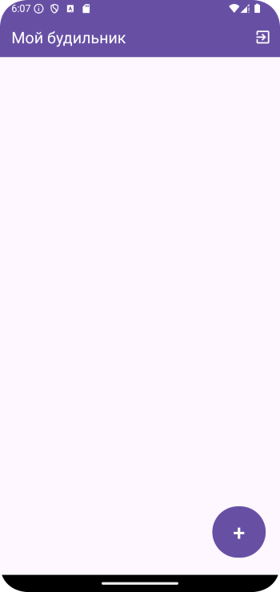

# Домашнее задание по теме "AlarmClock"

### Приложение «Мой будильник»

На основе материала занятия по созданию будильника, необходимо его доработать. На первом экране, после запуска приложения, после установки времени, оно должно проецироваться в текстовом поле вывода.

Когда будильник сработает, на втором экране необходимо поместить **gif** – изображение, кнопку отключения будильника. Кроме того, на обоих экранах существует либо кнопки выхода из приложения, либо меню с пунктом выхода **«Exit»**. На обоих экранах должны быть **Toolbar** с заголовком на первом экране. Логика работы описана приложения может быть идентичной занятию.

Для работы приложения необходимо создать:

На первом экране:

1. **Toolbar** c заголовком.

2. Поле вывода установленного времени.

3. Кнопка **«Установить будильник»**.

4. Меню с пунктом **«Exit»**, либо кнопка выхода.

На втором экране:

1. **imageView** для **gif**.

2. Кнопка отключения будильника **«Выключить будильник»**.

3. Меню с пунктом **«Exit»**, либо кнопка выхода.

**\*\*\* Необязательно, но желательно (усложненный уровень).**

В качестве личного совершенствования, изучив самостоятельно материал, написать логику и оформить в приложении порядок создания нескольких будильников и работу с ними.

Приложение необходимо сохранить проектом в удаленном репозитории, для проверки качества предоставить ссылку преподавателю, либо сделать видео экрана реального устройства в процессе работы приложения.

### Скриншоты к домашнему заданию по теме "AlarmClock"

Здесь скриншоты

